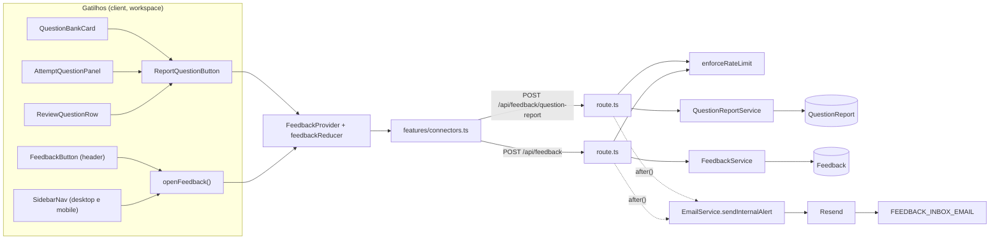
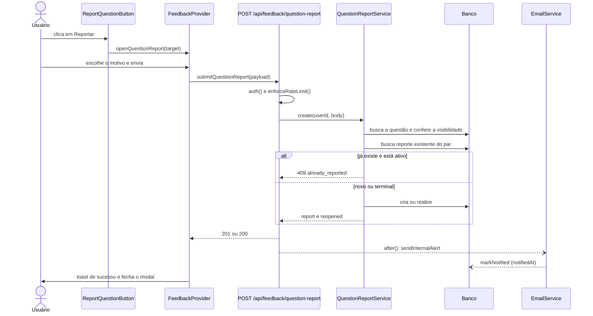

# SDD — Feedback e Comunicação

| | |
|---|---|
| **Tópico** | Como os usuários falam com o time e como o time os ouve |
| **Status** | Ativo · Fase 0 em implementação |
| **Versão** | 1.0 (2026-09-25) |
| **Autor** | Claude (Solution Architect) · **Aprovação de escopo:** Guilherme Holanda |
| **Roadmap** | [feedback-e-comunicacao](../roadmap/feedback-e-comunicacao.md) |
| **ADRs** | [0002](../adr/0002-persistencia-de-feedback-sem-foreign-key.md) · [0003](../adr/0003-notificar-o-time-por-email-por-evento.md) · [0004](../adr/0004-provider-unico-de-feedback-com-reducer.md) · [0005](../adr/0005-regras-de-negocio-validadas-no-service.md) · [0006](../adr/0006-um-reporte-por-usuario-por-questao-com-reabertura.md) · [0007](../adr/0007-moderacao-de-questoes-adiada.md) |

## Índice

1. [Objetivo e escopo](#objetivo-e-escopo)
2. [Glossário](#glossário)
3. [Requisitos](#requisitos)
4. [Regras de negócio](#regras-de-negócio)
5. [Arquitetura](#arquitetura)
6. [Modelo de dados](#modelo-de-dados)
7. [Contratos de API](#contratos-de-api)
8. [Backend](#backend)
9. [Notificação ao time](#notificação-ao-time)
10. [Frontend](#frontend)
11. [Segurança e privacidade](#segurança-e-privacidade)
12. [Observabilidade](#observabilidade)
13. [Estratégia de testes](#estratégia-de-testes)
14. [Rollout e operação](#rollout-e-operação)
15. [Decisões de design](#decisões-de-design)
16. [Questões em aberto](#questões-em-aberto)
17. [Evolução](#evolução)
18. [Histórico de revisões](#histórico-de-revisões)

---

## Objetivo e escopo

A plataforma tem 5 usuários e nenhum canal de feedback. Este documento especifica **a Fase 1 do roadmap**: a
infraestrutura compartilhada (Fase 0), o **reporte de questão** (F1) e o **widget de feedback global** (F2).

**Dentro do escopo**

- Persistir reportes de questão e feedbacks gerais em tabelas novas.
- Avisar o time por e-mail a cada envio.
- Botões de reporte nas três telas que exibem uma questão; botão de feedback no header e no menu lateral.
- Textos em português e inglês.

**Fora do escopo (decisões registradas)**

| Item | Onde está decidido |
|---|---|
| Retirar a questão de circulação após reporte | [ADR-0007](../adr/0007-moderacao-de-questoes-adiada.md) |
| Tela de inbox no admin (F3) | Backlog do roadmap |
| Resposta ao usuário / notificação de "resolvido" (F5) | Backlog do roadmap |
| Feedback em páginas públicas de marketing | Não previsto; `Feedback.userId` nulável deixa a porta aberta ([ADR-0002](../adr/0002-persistencia-de-feedback-sem-foreign-key.md)) |
| Alterar `ExamQuestion` ou qualquer model existente | Não aprovado |

> **SDDs do backlog (F3–F7) não foram escritos de propósito.** Cada um será escrito quando o item for promovido
> (gatilhos no roadmap), com o que se aprender da Fase 1. A seção [Evolução](#evolução) só registra os ganchos
> que este design já deixa prontos.

### Escopo por fase

| Fase | Entrega | Ids do roadmap |
|---|---|---|
| **0** | Models + migrations, i18n, constantes, tipos, connectors, rate limit, `EmailService.sendInternalAlert`, `FeedbackProvider` + reducer + resolvedor de erro, suporte de E2E | 0.1 – 0.14 |
| **1 / F1** | Rota e service de reporte, modal e botão, três superfícies, e-mail do reporte | 1.1 – 1.11 |
| **1 / F2** | Rota e service de feedback, modal, botão no header e no `SidebarNav`, e-mail do feedback | 2.1 – 2.9 |

---

## Glossário

| Termo | Significado |
|---|---|
| **Reporte** (`QuestionReport`) | Aviso de um usuário de que uma questão específica tem um problema |
| **Feedback** (`Feedback`) | Mensagem geral do usuário sobre a plataforma (bug, sugestão, elogio, dúvida) |
| **Superfície** (`surface`) | Tela de onde o reporte partiu: `question_bank`, `attempt` (durante o simulado) ou `review` (revisão do resultado) |
| **Snapshot** | Cópia, no momento do envio, de dados lidos do banco, para o registro ser autossuficiente ([ADR-0002](../adr/0002-persistencia-de-feedback-sem-foreign-key.md)) |
| **Status ativo** | `open`, `triaged`, `accepted` |
| **Status terminal** | `rejected`, `fixed` |
| **Questão de pool** | `ExamQuestion` com `userId = null` (catálogo compartilhado) |
| **Inbox** | Endereço em `FEEDBACK_INBOX_EMAIL` |

---

## Requisitos

### Funcionais

| Id | Requisito |
|---|---|
| RF-01 | O usuário reporta uma questão a partir do banco de questões, durante o simulado e na revisão do resultado |
| RF-02 | O reporte exige um motivo (6 opções) e aceita um comentário livre opcional |
| RF-03 | O usuário envia feedback geral (4 categorias + texto) pelo header (desktop) e pelo menu lateral (desktop e mobile) |
| RF-04 | O time é avisado por e-mail a cada reporte e a cada feedback |
| RF-05 | O usuário recebe confirmação de sucesso e mensagens específicas para "já reportada" e "muitos envios" |
| RF-06 | O contexto é capturado automaticamente: questão, superfície e simulado (reporte); rota, plano, navegador e idioma (feedback) |
| RF-07 | Toda a interface está em português e inglês |

### Não funcionais

| Id | Requisito |
|---|---|
| RNF-01 | O envio nunca espera nem depende do e-mail: primeiro persiste, depois notifica (`after()`) |
| RNF-02 | Falha de Redis ou de Resend nunca impede o registro do reporte/feedback |
| RNF-03 | Nenhum dado de outro usuário é exposto ou revelado (nem a existência de uma questão alheia) |
| RNF-04 | Acessibilidade: gatilhos com rótulo acessível, modal com foco gerenciado pelo HeroUI, grupo de rádios rotulado, operável por teclado |
| RNF-05 | Acessível em telas abaixo de 768 px (o header some no mobile) |
| RNF-06 | Nenhuma dependência nova no `package.json` |
| RNF-07 | Lógica de decisão em módulos puros testáveis no vitest `environment: 'node'` (sem jsdom) |

---

## Regras de negócio

Os ids são **estáveis**: nunca renumerar. Testes citam o id no título (`it('RN-11: …')`). Uma regra removida vira
`RN-nn (removida)`.

### Acesso e limites

| Id | Regra | Onde é imposta | Fase |
|---|---|---|---|
| RN-01 | Só usuário autenticado envia reporte ou feedback (401 caso contrário). `auth.config.ts` **não** recebe rotas novas | Handler (`auth()`) | 1 |
| RN-02 | Limite por usuário, janela deslizante: `question_report` = 8 a cada 5 min; `feedback_submit` = 3 a cada 10 min. Excedido → 429 com `code: 'rate_limited'`. Sem Redis o limite não se aplica (fail-open, herdado de `lib/rate-limit.ts`) | `enforceRateLimit` | **0** |
| RN-03 | O limite é consumido **antes** de ler o corpo e de tocar o banco, inclusive para payload inválido | Handler | 1 |

### Reporte de questão

| Id | Regra | Onde é imposta | Fase |
|---|---|---|---|
| RN-04 | `examQuestionId` é inteiro positivo (`Number.isInteger`); string numérica **não** é aceita. Inválido → 400 | `QuestionReportService` | 1 |
| RN-05 | `reason` ∈ `wrong_answer_key`, `ambiguous_statement`, `out_of_scope`, `typo`, `duplicate_options`, `other`. Fora → 400 | Service | 1 |
| RN-06 | `surface` ∈ `question_bank`, `attempt`, `review`. Fora → 400 | Service | 1 |
| RN-07 | `comment` é opcional; recebe `trim()`; após o trim tem no máximo **1000** caracteres (senão 400); vazio vira `null` | Service | 1 |
| RN-08 | A questão precisa existir e ser **visível**: `ExamQuestion.userId` é `null` (pool) ou igual ao solicitante. Caso contrário → **404** (não 403: não revela que a questão existe) | Service | 1 |
| RN-09 | `mockExamAttemptId` é opcional; só é aceito com `surface` `attempt` ou `review` (com `question_bank` → 400) e precisa pertencer ao solicitante (senão 404) | Service | 1 |
| RN-10 | `questionText`, `examName`, `sectionName` e `topicName` vêm **do banco**; campos homônimos no payload são ignorados | Service | 1 |
| RN-11 | Um reporte por par (usuário, questão), garantido pelo índice único. Reportar de novo com status **ativo** → 409 `already_reported`. Com status **terminal** → reabre (ver RN-12). Corrida (`P2002` no insert) → 409 `already_reported` | Service + banco ([ADR-0006](../adr/0006-um-reporte-por-usuario-por-questao-com-reabertura.md)) | 1 |
| RN-12 | **Reabrir** = `status = 'open'`; motivo, comentário, `surface`, `mockExamAttemptId` e snapshot atualizados; `resolvedAt`, `resolutionNote` e `notifiedAt` zerados; resposta **200**; e-mail reenviado como "reaberto". Reporte novo nasce `open` com `notifiedAt = null` e responde **201** | Service | 1 |

### Feedback geral

| Id | Regra | Onde é imposta | Fase |
|---|---|---|---|
| RN-13 | `category` ∈ `bug`, `suggestion`, `praise`, `question`. Fora → 400 | `FeedbackService` | 1 |
| RN-14 | `message` recebe `trim()`, não pode ser vazia e tem no máximo **2000** caracteres. Senão → 400 | Service | 1 |
| RN-15 | `route` é truncada em **200** (valor do client não é confiável); `locale` só é gravado se for `pt` ou `en` (senão `null`); `userAgent` vem do **header** da requisição, truncado em **300** | Service / handler | 1 |
| RN-16 | `plan` e `email` são snapshots lidos do `User` **no momento do envio**; nunca vêm do client | Service | 1 |
| RN-17 | Feedback **não** tem dedupe: dois feedbacks seguidos são dois pensamentos. O rate limit é o único freio | — | 1 |
| RN-18 | `userId` vem sempre da sessão, nunca do payload (vale para reporte e feedback) | Handler/service | 1 |

### Notificação ao time

| Id | Regra | Onde é imposta | Fase |
|---|---|---|---|
| RN-19 | **Persistir primeiro, notificar depois.** Falha do e-mail nunca falha a requisição nem apaga o registro; `sendInternalAlert` nunca lança | Handler (`after()`) + `EmailService` | **0** (método) / 1 (uso) |
| RN-20 | O e-mail só é enviado se `FEEDBACK_INBOX_EMAIL` estiver definida (sem fallback). Sem ela: `logger.warn` e nada é enviado | `EmailService` | **0** |
| RN-21 | Todo texto vindo do usuário é escapado (`escapeHtml`) antes de entrar no HTML; o **assunto** nunca carrega texto livre | `buildInternalAlert` | **0** |
| RN-22 | `notifiedAt` recebe o instante do envio bem-sucedido; falha o mantém `null` | Handler + service (`markNotified`) | 1 |

### Interface

| Id | Regra | Onde é imposta | Fase |
|---|---|---|---|
| RN-23 | Um diálogo de feedback por vez; abrir e fechar são **ignorados** enquanto há envio em andamento (`isBusy`); `submitStarted` sem diálogo aberto é ignorado; falha mantém o diálogo aberto; sucesso reinicia o estado | `feedbackReducer` | **0** |
| RN-24 | Falha de envio mantém o diálogo aberto para nova tentativa | Provider | **0** |
| RN-25 | Mensagens de erro do envio são **sempre chaves i18n**, escolhidas por `resolveFeedbackError`: `rate_limited` (ou HTTP 429) → "muitos envios"; `already_reported` (só reporte) → "já reportada"; qualquer outro → erro genérico do tipo. A mensagem do servidor **não** é exibida | `lib/feedback-error.ts` | **0** |
| RN-26 | Reportar durante o simulado **não** pausa o cronômetro, e abrir o modal não dispara o guard de navegação | Componentes (F1) | 1 |
| RN-27 | O modal de feedback informa que rota, plano e navegador seguem junto (`feedback.contextNotice`) | Componente (F2) | 1 |
| RN-28 | O gatilho global é alcançável no mobile (botão no `SidebarNav`, presente no rail desktop e no drawer mobile) | Componente (F2) | 1 |

### Privacidade

| Id | Regra | Onde é imposta | Fase |
|---|---|---|---|
| RN-29 | Feedback e reporte são **dados pessoais** (e-mail, texto livre). Sem FK não há cascade: qualquer exclusão de conta ou atendimento a pedido LGPD **deve** apagar ou anonimizar `Feedback` e `QuestionReport` por `userId` | Processo (rotina futura) | — |

---

## Arquitetura

### Visão geral



### Fluxo do reporte de questão



### Convenções do repositório que este design segue

| Convenção | Fonte |
|---|---|
| Rota em `app/api/<área>/route.ts` + service co-localizado, classe com Prisma por construtor | `app/api/CLAUDE.md`, `app/api/search/` |
| Erros sempre por `toApiErrorResponse`; erros de regra com `Object.assign(new Error(), { status })` | `lib/api-error.ts` |
| HTTP de componente só por `features/connectors.ts`; mutação em `try/catch` | `CLAUDE.md` |
| Context + Reducer, um provider por domínio | `CLAUDE.md` |
| Sem comentários no código; imports com `@/`; exports nomeados | `CLAUDE.md` |

---

## Modelo de dados

Colunas escalares, **sem `@relation`** ([ADR-0002](../adr/0002-persistencia-de-feedback-sem-foreign-key.md)). Os dois
arquivos ([prisma/dev/schema.prisma](../../prisma/dev/schema.prisma) e
[prisma/prod/schema.prisma](../../prisma/prod/schema.prisma)) diferem só nas linhas 1 e 6.

### `QuestionReport`

```prisma
model QuestionReport {
  id                String    @id @default(cuid())
  examQuestionId    Int
  userId            String
  reason            String
  comment           String?
  questionText      String
  examName          String
  sectionName       String?
  topicName         String?
  surface           String
  mockExamAttemptId Int?
  status            String    @default("open")
  resolutionNote    String?
  resolvedAt        DateTime?
  notifiedAt        DateTime?
  createdAt         DateTime  @default(now())
  updatedAt         DateTime  @updatedAt

  @@unique([userId, examQuestionId])
  @@index([status, createdAt])
  @@index([examQuestionId])
}
```

| Campo | Decisão |
|---|---|
| `examQuestionId` | `Int`, casa com `ExamQuestion.id`. **Sem FK** |
| `userId` | **Não-nulável:** `NULL` é distinto em índice único no PostgreSQL e quebraria o dedupe |
| `reason`, `surface`, `status` | `String`, whitelist no service (SQLite não tem enum no Prisma) |
| `comment` | Máx. 1000 após `trim()` (RN-07) |
| `questionText`, `examName`, `sectionName`, `topicName` | Snapshot do banco (RN-10) |
| `mockExamAttemptId` | Só para `attempt`/`review` (RN-09) |
| `status` | `open` · `triaged` · `accepted` · `rejected` · `fixed`. A Fase 1 só escreve `open`; os demais são do F3 |
| `resolutionNote`, `resolvedAt` | Do F3. Já na migration para evitar uma segunda |
| `notifiedAt` | Instante do e-mail bem-sucedido (RN-22). `NULL` = não notificado |
| `updatedAt` | Reabrir (RN-12) não altera `createdAt`; `updatedAt` mostra a atividade mais recente |

| Índice | Serve a |
|---|---|
| `@@unique([userId, examQuestionId])` | Dedupe no banco (RN-11) |
| `@@index([status, createdAt])` | Fila de triagem do F3 |
| `@@index([examQuestionId])` | "Quantos usuários reportaram esta questão" |

**Ciclo de vida do status** (transições de `triaged` em diante pertencem ao F3):

| De | Para | Quem |
|---|---|---|
| — | `open` | Usuário (criação) |
| `open` | `triaged`, `rejected` | Time (F3) |
| `triaged` | `accepted`, `rejected` | Time (F3) |
| `accepted` | `fixed` | Time (F3) |
| `rejected`, `fixed` | `open` | Usuário reportando de novo (RN-12) |

### `Feedback`

```prisma
model Feedback {
  id         String    @id @default(cuid())
  userId     String?
  email      String?
  plan       String?
  category   String
  message    String
  route      String?
  userAgent  String?
  locale     String?
  status     String    @default("open")
  notifiedAt DateTime?
  createdAt  DateTime  @default(now())
  updatedAt  DateTime  @updatedAt

  @@index([status, createdAt])
  @@index([userId])
}
```

| Campo | Decisão |
|---|---|
| `userId` | **Nulável** ([ADR-0002](../adr/0002-persistencia-de-feedback-sem-foreign-key.md) §5). Hoje é sempre preenchido |
| `email`, `plan` | Snapshot do `User` no envio (RN-16) |
| `category` | `bug` · `suggestion` · `praise` · `question` (RN-13) |
| `message` | Máx. 2000 após `trim()` (RN-14) |
| `route`, `userAgent`, `locale` | Contexto automático (RN-15) |
| `status` | `open` na criação. Valores adicionais são definidos pelo F3 |

### Migrations

Uma **única** migration pareada, `add_feedback_tables`:

| | Dev (SQLite) | Prod (PostgreSQL) |
|---|---|---|
| Pasta | `prisma/dev/migrations/<ts>_add_feedback_tables/` | `prisma/prod/migrations/<ts+1s>_add_feedback_tables/` |
| Geração | SQL gerado pelo Prisma (`migrate diff`), aplicado com `migrate deploy` | SQL gerado pelo Prisma para PostgreSQL (`migrate diff` entre datamodels), com cabeçalho e `IF NOT EXISTS` no estilo de `20260901003406_add_generation_job_language` |
| Tipos | `DATETIME`, PK inline | `TIMESTAMP(3)`, `CONSTRAINT "X_pkey" PRIMARY KEY` |
| FK | Nenhuma | Nenhuma |

O sufixo (`add_feedback_tables`) precisa ser **idêntico** nas duas pastas: `tests/unit/api/migration-completeness.test.ts`
pareia por sufixo e rejeita `DATETIME`, `AUTOINCREMENT` e `PRAGMA` em prod. A migration dev nasce de `migrate diff`
seguido de `migrate deploy` — a mesma saída que `migrate dev` escreveria, sem depender de prompt interativo.

---

## Contratos de API

Erros seguem `toApiErrorResponse`; o handler devolve `{ error, message?, code?, limit?, used? }` com o status
HTTP (o campo `status` sai do corpo).

### `POST /api/feedback/question-report`

Arquivos: `app/api/feedback/question-report/route.ts` e `question-report.service.ts` (F1).

**Corpo**

| Campo | Tipo | Obrigatório | Regra |
|---|---|---|---|
| `examQuestionId` | `number` | sim | RN-04 |
| `reason` | `string` | sim | RN-05 |
| `surface` | `string` | sim | RN-06 |
| `comment` | `string` | não | RN-07 |
| `mockExamAttemptId` | `number` | não | RN-09 |

**Respostas**

| Status | Corpo | Quando |
|---|---|---|
| **201** | `{ id, status: "open", createdAt }` | Reporte criado |
| **200** | `{ id, status: "open", createdAt }` | Reporte terminal reaberto (RN-12) |
| 400 | `{ error, message }` | Payload inválido (RN-04 a RN-07, RN-09) |
| 401 | `{ error: "Unauthorized" }` | Sem sessão (RN-01) |
| 404 | `{ error, message }` | Questão inexistente ou alheia; simulado alheio (RN-08, RN-09) |
| 409 | `{ error, message, code: "already_reported" }` | Reporte ativo já existe, ou corrida (RN-11) |
| 429 | `{ error, message, code: "rate_limited", limit, used }` | Limite estourado (RN-02) |
| 500 | `{ error }` | Falha inesperada |

### `POST /api/feedback`

Arquivos: `app/api/feedback/route.ts` e `feedback.service.ts` (F2).

**Corpo**

| Campo | Tipo | Obrigatório | Regra |
|---|---|---|---|
| `category` | `string` | sim | RN-13 |
| `message` | `string` | sim | RN-14 |
| `route` | `string` | não | RN-15 |
| `locale` | `string` | não | RN-15 |

`plan`, `email` e `userAgent` **não** fazem parte do corpo: o servidor os descobre (RN-15, RN-16).

**Respostas:** **201** `{ id }` · 400 · 401 · 429 `code: "rate_limited"` · 500.

### Ordem do handler (RN-03, [ADR-0005](../adr/0005-regras-de-negocio-validadas-no-service.md))

`auth()` → 401 → `enforceRateLimit` → 429 → `request.json().catch(() => null)` → 400 se nulo → `service.create` →
resposta → `after()` do e-mail. O `catch` faz `logApiError` + `toApiErrorResponse`.

---

## Backend

### `QuestionReportService` (F1)

Construtor: `constructor(prismaClient: PrismaClient = defaultPrisma as unknown as PrismaClient)`.

| Método | Comportamento |
|---|---|
| `create(userId, input: unknown)` | Valida (RN-04 a RN-07, RN-09) → carrega a questão e confere a visibilidade (RN-08) → confere o simulado (RN-09) → procura reporte existente (RN-11) → cria ou reabre (RN-12). Devolve `{ report, reopened, reporter: { email, plan } }`; o `reporter` é lido do `User` só para o e-mail e **não é gravado** |
| `markNotified(reportId)` | `update` de `notifiedAt = now()` (RN-22) |

Erros: `Object.assign(new Error(msg), { status })`; o 409 leva `body: { code: 'already_reported' }`, que
`quotaDetail()` em `lib/api-error.ts` repassa ao client. `P2002` no insert é convertido no mesmo 409 (RN-11).

### `FeedbackService` (F2)

| Método | Comportamento |
|---|---|
| `create(userId, input: unknown, userAgent: string \| null)` | Valida (RN-13, RN-14) → lê `email` e `plan` do `User` (RN-16) → normaliza `route`, `locale`, `userAgent` (RN-15) → cria |
| `markNotified(feedbackId)` | Idem RN-22 |

### Rate limit (Fase 0)

Duas entradas em `RateLimitedAction` e `LIMITS` de [lib/rate-limit.ts](../../lib/rate-limit.ts):

| Ação | Limite | Por quê |
|---|---|---|
| `question_report` | 8 / 5 min | Uma passada de revisão de simulado gera 4–6 reportes legítimos seguidos; 5/min seria fricção. O índice único é o freio real contra abuso — o limite protege sobretudo o e-mail |
| `feedback_submit` | 3 / 10 min | O widget é um pensamento por vez; 3 é generoso e limita spam no inbox |

`window` só aceita segundos e minutos (`` `${number} ${'s' | 'm'}` ``). O limite é **fail-open** sem Redis: em dev
e E2E nunca dispara, então o caso 429 **não é testável em E2E** — só em unitário.

### Constantes e tipos (Fase 0)

- `config/constants/feedback.ts`, re-exportado por `config/constants/index.ts` (mesmo padrão de
  `generation-job.ts`): URLs, listas de motivos/categorias/superfícies/status (cada motivo e categoria com o
  `labelKey` i18n **explícito**, sem convenção mágica), limites de tamanho e os tipos derivados.
- `shared/types/index.ts`: `SubmitQuestionReportPayload`, `QuestionReportResult`, `SubmitFeedbackPayload`,
  `FeedbackResult`.
- `features/connectors.ts`: `submitQuestionReport(payload)` e `submitFeedback(payload)`.

---

## Notificação ao time

Decisão em [ADR-0003](../adr/0003-notificar-o-time-por-email-por-evento.md).

### `EmailService` (Fase 0)

Três peças em [features/services/email.service.ts](../../features/services/email.service.ts):

```ts
export function escapeHtml(value: string): string;

export interface InternalAlertInput {
  readonly subject: string;
  readonly heading: string;
  readonly rows: ReadonlyArray<{ readonly label: string; readonly value: string }>;
  readonly body?: string;
}

export function buildInternalAlert(input: InternalAlertInput): { subject: string; html: string; text: string };

class EmailService {
  async sendInternalAlert(input: InternalAlertInput): Promise<boolean>;
}
```

| Aspecto | Comportamento |
|---|---|
| `escapeHtml` | Escapa `& < > " '`. Aplicado a `heading`, `rows[].label`, `rows[].value` e `body` (RN-21) |
| `buildInternalAlert` | **Função pura**, exportada do módulo: testável sem instanciar `EmailService` (cujo construtor cria o cliente Resend). Reusa `emailLayout`. Assunto: prefixo fixo, espaços em branco normalizados e truncado; quebras de linha do `body` viram `<br>` depois do escape. Versão em texto puro com `label: value` |
| `sendInternalAlert` | `to = process.env.FEEDBACK_INBOX_EMAIL`, lido **na chamada**. Ausente → `logger.warn` e `false` (RN-20). Erro do Resend ou exceção → `logger.warn` e `false`. Nunca lança (RN-19). `true` só quando o Resend confirma |

### Conteúdo dos e-mails (montado em F1 e F2)

| Evento | Assunto (rótulos fixos) | Linhas | Corpo |
|---|---|---|---|
| Reporte | `[CertifiqueAI] Reporte de questão — <rótulo do motivo>` (`Reaberto` quando `reopened`) | Motivo, Exame, Seção, Tópico, Superfície, Questão (id), Usuário (e-mail), Plano | Enunciado da questão + comentário |
| Feedback | `[CertifiqueAI] Feedback — <rótulo da categoria>` | Categoria, Usuário (e-mail), Plano, Rota, Idioma, Navegador | Mensagem |

Os rótulos do assunto vêm de mapas fixos em português — **nunca** de texto livre (RN-21).

### Operação

- `FEEDBACK_INBOX_EMAIL` é **opt-in e sem fallback**. Não definir em `.env.test`. Documentada no
  [README.md](../../README.md) e configurada na Vercel (Production).
- Reporte/feedback sem e-mail enviado ficam com `notifiedAt IS NULL` — dá para reenviar ou virar digest sem
  migration.
- Se a variável faltar na Vercel, o registro é salvo e **ninguém é avisado**; o único sinal é o
  `logger.warn('email.internal_alert_skipped')`.

---

## Frontend

### Componentes

| Arquivo | Papel | Fase |
|---|---|---|
| `features/reducers/feedback.reducer.ts` | `feedbackReducer` puro + `INITIAL_FEEDBACK_STATE` | **0** |
| `features/providers/feedback.provider.tsx` | `FeedbackProvider` + `FeedbackContext`; dono do estado, do envio e dos toasts | **0** |
| `features/hooks/useFeedback.hook.ts` | `useContext(FeedbackContext)` | **0** |
| `lib/feedback-error.ts` | `resolveFeedbackError(err, kind)` puro | **0** |
| `shared/components/ui/ReportQuestionModal.tsx` | Modal apresentacional: `RadioGroup` de motivos + `Textarea` | F1 |
| `shared/components/ui/ReportQuestionButton.tsx` | Gatilho: `{ examQuestionId, surface, mockExamAttemptId? }`. `isIconOnly`, `buttonStyles.iconOnly.neutral`, `faFlag` | F1 |
| `shared/components/ui/FeedbackModal.tsx` | Modal apresentacional: categoria + mensagem + aviso de contexto | F2 |
| `shared/components/ui/workspace-header/FeedbackButton.tsx` | Gatilho do header, com a classe do trigger do sino e `faCommentDots` | F2 |

O `FeedbackProvider` é montado em [app/(workspace)/layout.tsx](../../app/(workspace)/layout.tsx) **dentro** do
`LimitModalProvider`. Em F1/F2 ele passa a renderizar os modais por props ([ADR-0004](../adr/0004-provider-unico-de-feedback-com-reducer.md)).

### Estado (`feedbackReducer`, RN-23)

```ts
interface FeedbackState {
  readonly reportTarget: QuestionReportTarget | null;
  readonly isFeedbackOpen: boolean;
  readonly isBusy: boolean;
}
```

| Ação | Efeito |
|---|---|
| `openQuestionReport(target)` | Se `isBusy`, ignora. Senão `reportTarget = target`, `isFeedbackOpen = false` |
| `openFeedback` | Se `isBusy`, ignora. Senão `isFeedbackOpen = true`, `reportTarget = null` |
| `submitStarted` | Se nenhum diálogo está aberto, ignora. Senão `isBusy = true` |
| `submitFailed` | `isBusy = false`; o diálogo continua aberto (RN-24) |
| `submitSucceeded` | Volta ao estado inicial |
| `close` | Se `isBusy`, ignora. Senão volta ao estado inicial |

Contexto padrão (fora do provider) é inerte, como `LimitModalContext`.

### Erros (`resolveFeedbackError`, RN-25)

Entrada: o erro do axios e o tipo (`question_report` | `feedback`). Lê `err.response.status` e
`err.response.data.code`.

| Condição | Chaves i18n devolvidas |
|---|---|
| `code === 'rate_limited'` **ou** status 429 | `feedback.rateLimitedTitle` / `feedback.rateLimitedDescription` |
| `kind === 'question_report'` **e** `code === 'already_reported'` | `feedback.alreadyReportedTitle` / `feedback.alreadyReportedDescription` |
| `kind === 'question_report'` (qualquer outro) | `feedback.reportErrorTitle` / `feedback.reportErrorDescription` |
| `kind === 'feedback'` (qualquer outro) | `feedback.sendErrorTitle` / `feedback.sendErrorDescription` |

Isso **desvia deliberadamente** de "`err.response.data.message` com fallback para chave" (CLAUDE.md): a mensagem de
429 em `lib/rate-limit.ts` é português fixo e o 409 do servidor não é traduzido. O `already_reported` mantém o
modal aberto; refinar isso é decisão de UX do F1.

### Superfícies (F1)

| Tela | Local | Mudança |
|---|---|---|
| [QuestionBankCard.tsx](../../app/(workspace)/question-bank/components/QuestionBankCard.tsx) | `renderActions()`, antes do botão de excluir | Só o botão. Sem mudança em `QuestionBankContent.tsx` |
| [AttemptQuestionPanel.tsx](../../app/(workspace)/simulados/[id]/tentativa/[attemptId]/components/AttemptQuestionPanel.tsx) | Linha de cabeçalho da questão, à direita do contador | Prop nova `attemptId: number`, passada por `AttemptShell.tsx` (que já a tem) |
| [ReviewQuestionRow.tsx](../../app/(workspace)/simulados/[id]/resultado/[attemptId]/components/ReviewQuestionRow.tsx) | Rodapé `border-t border-divider pt-3` → `flex justify-between` | `question.examQuestionId` já está disponível |

### Gatilho global e o mobile (F2)

O header do workspace é `hidden md:flex`; no mobile só existe `SidebarMobileTopBar`.

| Onde | Como |
|---|---|
| Desktop | `FeedbackButton` no [WorkspaceHeader.tsx](../../shared/components/ui/workspace-header/WorkspaceHeader.tsx), **antes** do sino, copiando literalmente a classe do trigger do sino |
| Desktop **e** mobile | Botão em [SidebarNav.tsx](../../shared/components/ui/sidebar/SidebarNav.tsx), depois do `NAV_GROUPS.map(...)`, no formato do bloco condicional de admin. `SidebarNav` é renderizado no rail desktop **e** no drawer mobile ⇒ um ponto de inserção cobre os dois. `onClick` chama `openFeedback()` e `onClose?.()` |

Descartados: replicar o header no `SidebarMobileTopBar` (duplica sino, popover e badge de uso); item no
`UserDropdown` (não existe no mobile); mudar a interface `NavItem` (baseada em `href`).

### i18n

Namespace único **`feedback`**, registrado em `WORKSPACE_MESSAGE_PREFIXES` ([config/i18n-prefixes.ts](../../config/i18n-prefixes.ts)).
Todas as 44 chaves entram na Fase 0, em `pt.properties` e `en.properties`, **na mesma posição** (arquivos
alinhados linha a linha), com acento literal UTF-8.

- **Reporte (25):** `reportQuestion`, `reportQuestionAria`, `reportModalTitle`, `reportModalSubtitle`,
  `reasonLabel`, `reasonWrongAnswerKey`, `reasonAmbiguousStatement`, `reasonOutOfScope`, `reasonTypo`,
  `reasonDuplicateOptions`, `reasonOther`, `commentLabel`, `commentPlaceholder`, `commentHelper`,
  `commentTooLong`, `reasonRequired`, `submitReport`, `reportSuccessTitle`, `reportSuccessDescription`,
  `reportErrorTitle`, `reportErrorDescription`, `alreadyReportedTitle`, `alreadyReportedDescription`,
  `rateLimitedTitle`, `rateLimitedDescription`
- **Feedback (19):** `navLabel`, `widgetAria`, `widgetTitle`, `widgetSubtitle`, `categoryLabel`, `categoryBug`,
  `categorySuggestion`, `categoryPraise`, `categoryQuestion`, `messageLabel`, `messagePlaceholder`,
  `messageRequired`, `messageTooLong`, `contextNotice`, `send`, `sendSuccessTitle`, `sendSuccessDescription`,
  `sendErrorTitle`, `sendErrorDescription`

Reaproveita `common.cancel`. `{max}` é o placeholder de limite de caracteres.

### Acessibilidade (RNF-04)

Gatilhos com `aria-label` (`reportQuestionAria`, `widgetAria`); modal do HeroUI (foco preso e devolvido ao
gatilho); motivos em `RadioGroup` com `label`; contador de caracteres associado ao campo; envio operável por
teclado. **Nota de teste:** o `Radio` do HeroUI tem o input com `opacity: 0.0001` — em E2E usar
`dispatchEvent('click')`, nunca `.click({ force: true })`.

---

## Segurança e privacidade

| Ameaça | Mitigação |
|---|---|
| Acesso anônimo | RN-01: `auth()` no handler; `auth.config.ts` não é estendido |
| IDOR: reportar/ler questão ou simulado alheio | RN-08 e RN-09: 404, sem revelar existência (RNF-03) |
| Client forja `userId`, `plan`, `email`, snapshot | RN-10, RN-16, RN-18: o servidor descobre; o payload é ignorado |
| Injeção de HTML no e-mail do time | RN-21: `escapeHtml`; assunto sem texto livre |
| Spam / abuso | RN-02 (rate limit) + índice único (RN-11) |
| Payload gigante | Validação de tamanho no service; a Vercel limita o corpo da requisição |
| E-mail real disparado em dev/E2E | RN-20: destinatário opt-in sem fallback |

### Dados pessoais

| Dado | Onde | Origem | Finalidade |
|---|---|---|---|
| E-mail | `Feedback.email` | Sessão (snapshot) | Permitir responder |
| Plano | `Feedback.plan` | Sessão (snapshot) | Priorizar e entender o contexto |
| Texto livre | `Feedback.message`, `QuestionReport.comment` | Usuário | O próprio feedback |
| Navegador | `Feedback.userAgent` | Header | Diagnóstico de bug |
| Rota, idioma | `Feedback.route`, `Feedback.locale` | Client | Contexto |
| Identificador do usuário | `QuestionReport.userId`, `Feedback.userId` | Sessão | Dedupe e atendimento |

- **Transparência:** `feedback.contextNotice` avisa que rota, plano e navegador seguem junto (RN-27).
- **Sem cascade** (RN-29): exclusão de conta e pedidos LGPD **devem** apagar/anonimizar as duas tabelas. Hoje não
  há fluxo de exclusão de conta no produto; o atendimento é por e-mail.
- **Retenção:** sem prazo definido — ver [Questões em aberto](#questões-em-aberto).
- **Política de privacidade:** a seção "1. Dados que coletamos" de
  `app/(marketing)/(site)/privacy/page.tsx` lista as categorias coletadas; o conteúdo de feedback é uma nova
  categoria. **Revisão pendente do dono do produto** (este design não altera páginas legais).

---

## Observabilidade

Logs estruturados via `lib/logger.ts` (JSON de uma linha). **Nunca** se loga texto livre do usuário.

| Evento | Nível | Campos |
|---|---|---|
| `feedback.question_report` (falha) | warn/error por status | `userId`, `status`, `error*` (via `logApiError`) |
| `feedback.submit` (falha) | warn/error por status | idem |
| `feedback.created` | info | `kind`, `id`, `reopened?` |
| `email.internal_alert_skipped` | warn | `reason` — variável ausente |
| `email.internal_alert_failed` | warn | `error*` |

**Consulta operacional:** registros que não chegaram ao time —
`SELECT id, "createdAt" FROM "QuestionReport" WHERE "notifiedAt" IS NULL` (idem `Feedback`).

---

## Estratégia de testes

Vitest `environment: 'node'`, sem jsdom e sem `@testing-library`: **componentes React não são testados em
unitário** (`tests/CLAUDE.md`). Decisão vai para módulo puro; o JSX é verificado por E2E (Playwright).

### Fase 0

| Arquivo | Cobre |
|---|---|
| `tests/unit/features/feedback.reducer.test.ts` | RN-23 |
| `tests/unit/lib/feedback-error.test.ts` | RN-25 |
| `tests/unit/lib/feedback-i18n.test.ts` | RF-07: cada `labelKey` e cada chave devolvida pelo resolvedor existe em pt **e** en; os conjuntos `feedback.*` de pt e en são idênticos |
| `tests/unit/lib/rate-limit.test.ts` (estendido) | RN-02: limite e janela das duas ações novas; isolamento de prefixo |
| `tests/unit/api/services/email.service.test.ts` | RN-19 (nunca lança), RN-20, RN-21, `escapeHtml`, `buildInternalAlert` |
| `tests/unit/api/migration-completeness.test.ts`, `schema-drift.test.ts`, `tests/unit/lib/i18n-prefixes.test.ts` (existentes) | Pareamento dev/prod, sintaxe de prod, drift, prefixo `feedback` declarado |

### Fase 1 (F1 e F2)

| Regra | Teste | Como |
|---|---|---|
| RN-04 a RN-12 | `tests/unit/api/services/question-report.service.test.ts` | Prisma mockado (`prismaMock`); erros por `rejects.toMatchObject({ status })` |
| RN-13 a RN-18 | `tests/unit/api/services/feedback.service.test.ts` | Idem |
| RN-22 | Unitário de `markNotified` + verificação manual em produção (o handler não é testado) | — |
| RN-01, RN-26, RN-27, RN-28 | `tests/e2e/tests/feedback.spec.ts` | Playwright; inclui 401 sem sessão, viewport mobile (390×844) e reenvio para validar o índice único |
| RN-03 | Revisão de código do handler | O handler não tem teste unitário |

E2E: seleção só por `data-testid` (catálogo em `tests/e2e/support/selectors.ts`, entradas adicionadas **junto
com os componentes**); `tests/e2e/support/db-cleanup.ts` apaga as duas tabelas (Fase 0).

---

## Rollout e operação

| Passo | Detalhe |
|---|---|
| 1. Merge da Fase 0 na `main` | O workflow `migrate-prod.yml` roda `prisma migrate deploy` **antes** do deploy da Vercel. A migration é **aditiva** (duas tabelas novas); nada lê as tabelas até F1/F2, então é segura |
| 2. Configurar `FEEDBACK_INBOX_EMAIL` na Vercel (Production) | Sem ela nenhum e-mail é enviado (RN-20). Faz parte do aceite da Fase 0 |
| 3. Local | `prisma migrate deploy` no `dev.db` e `npm run prisma:generate:dev`; **reiniciar o `next dev`** (o client Prisma mudou). Nunca `npm run build` com o dev server ativo |
| 4. F1, depois F2 | Cada uma em sua branch; SDD e roadmap atualizados no mesmo PR |
| Rollback | Reverter o código. As tabelas são inertes; removê-las exigiria uma migration nova e não é necessário |

---

## Decisões de design

Decisões menores que não justificam uma ADR, mas precisam ficar registradas.

| Id | Decisão | Por quê |
|---|---|---|
| D-01 | `updatedAt` nos dois models | Reabrir (RN-12) não muda `createdAt`; a fila do F3 precisa da atividade mais recente. Custa uma coluna agora, uma migration depois |
| D-02 | `sendInternalAlert` devolve `boolean` (o roadmap dizia `void`) | `notifiedAt` só pode ser preenchido se o chamador souber se enviou |
| D-03 | Constantes em `config/constants/feedback.ts`, re-exportadas | Precedente `generation-job.ts`; mantém o `index.ts` (já ~190 linhas) enxuto |
| D-04 | Namespace i18n único `feedback` (`feedback.navLabel`, sem `nav.feedback` nem `aria.sendFeedback`) | Um prefixo só, um bloco contíguo nos `.properties` |
| D-05 | Modais renderizados por props pelo próprio provider | Evita import circular provider↔modal; segue `LimitModalProvider` |
| D-06 | Wrappers `sendQuestionReportAlert`/`sendFeedbackAlert` ficam em F1/F2 | Dependem do formato exato do que cada service devolve; a Fase 0 entrega só o método genérico |
| D-07 | Entradas de `selectors.ts` entram com os componentes (F1/F2), não na Fase 0 | O catálogo é "mantido em sincronia com os `data-testid` dos componentes"; entradas sem componente seriam código morto |
| D-08 | Reportar não pausa o cronômetro do simulado | Leva segundos; pausar abriria brecha de burla (RN-26) |
| D-09 | `already_reported` mantém o modal aberto | Simplicidade; refinar é decisão de UX do F1 |

---

## Questões em aberto

| Id | Questão | Dono | Bloqueia |
|---|---|---|---|
| Q-01 | A promessa "itens sinalizados saem de circulação" ([ADR-0007](../adr/0007-moderacao-de-questoes-adiada.md)): aprovar o campo de moderação **ou** ajustar o copy | Guilherme | Lançamento público |
| Q-02 | A política de privacidade deve citar o conteúdo de feedback como categoria de dado? | Guilherme | Lançamento público |
| Q-03 | Prazo de retenção de `Feedback` e `QuestionReport` | Guilherme | — |
| Q-04 | Usar `replyTo = Feedback.email` no e-mail do time, para responder ao usuário com um "Responder"? Barato, mas ainda não pedido | Guilherme | F2 |
| Q-05 | `already_reported` deve fechar o modal? (D-09) | UX | F1 |

---

## Evolução

Ganhos já embutidos neste design, para os itens do backlog **não** exigirem migration só para isso:

| Item do backlog | Gancho |
|---|---|
| F3 — inbox admin | `status` nos dois models, `resolutionNote`/`resolvedAt`, índices `[status, createdAt]`, `updatedAt` |
| Digest ou reenvio de e-mail | `notifiedAt` (`IS NULL` = pendente) |
| F5 — fechar o loop | `Feedback.email` (snapshot) permite responder por e-mail. Notificação **no app** exige tabela nova: hoje `NotificationsProvider` é só `localStorage` |
| F4 — CSAT pós-simulado | Provável reuso de `Feedback` com nova `category`, o que alteraria a whitelist (RN-13) — checar antes de prometer |

---

## Histórico de revisões

| Versão | Data | Mudança |
|---|---|---|
| 1.0 | 2026-09-25 | Versão inicial: Fase 0, F1 e F2 |
